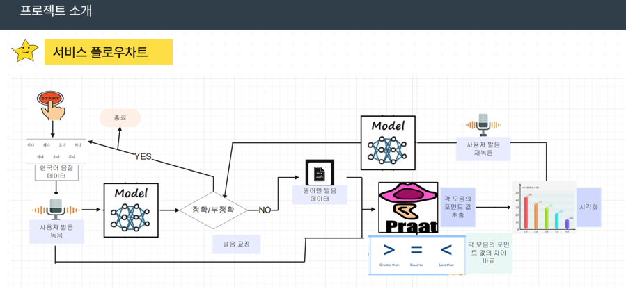

# AI음성인식 발음교정 서비스 Wanna-민(원어민)
(skku codeep_project)사용자의 발음을 인식하여 올바른 발음 교정을 돕는 AI 서비스입니다.

## stacks

## contributer
Lee Gyeomhee   
Lee Narin  
Sin Somang  
Cho Byeongung

## notes
(용량 상의 한계로 모델pth 파일은 올리지 않았습니다)
